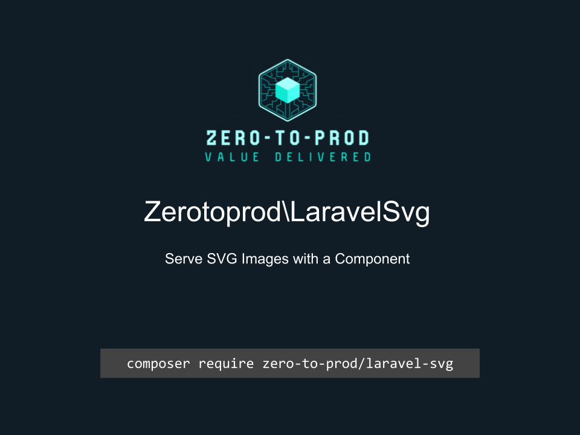

# Zerotoprod\LaravelSvg



[](https://github.com/zero-to-prod/laravel-svg)
[](https://github.com/zero-to-prod/laravel-svg/actions)
[](https://packagist.org/packages/zero-to-prod/laravel-svg/stats)
[](https://packagist.org/packages/zero-to-prod/laravel-svg/stats)
[](https://packagist.org/packages/zero-to-prod/laravel-svg)
[](https://github.com/zero-to-prod/laravel-svg/blob/main/LICENSE.md)
[](https://wakatime.com/badge/github/zero-to-prod/laravel-svg)
[](https://hitsofcode.com/github/zero-to-prod/laravel-svg/view?branch=main&label=Hits-of-Code)

Serve your svg files from an endpoint.

## Installation

You can install the package via Composer:

```bash
composer require zero-to-prod/laravel-svg
```

## Publish Vendor Files
```bash
php artisan vendor:publish --tag=laravel-svg-config
php artisan vendor:publish --tag=laravel-svg-views
```

## Usage

Create blade files under `resources/views/laravel_svg/svg`.

```bladehtml
<svg class="{{$classname}}" fill="{{$fill}}" xmlns="http://www.w3.org/2000/svg" viewBox="0 0 576 512">
    <path d="M575.8 255.5c0 18-15 32.1-32 32.1l-32 0 .7 160.2c0 2.7-.2 5.4-.5 8.1l0 16.2c0 22.1-17.9 40-40 40l-16 0c-1.1 0-2.2 0-3.3-.1c-1.4 .1-2.8 .1-4.2 .1L416 512l-24 0c-22.1 0-40-17.9-40-40l0-24 0-64c0-17.7-14.3-32-32-32l-64 0c-17.7 0-32 14.3-32 32l0 64 0 24c0 22.1-17.9 40-40 40l-24 0-31.9 0c-1.5 0-3-.1-4.5-.2c-1.2 .1-2.4 .2-3.6 .2l-16 0c-22.1 0-40-17.9-40-40l0-112c0-.9 0-1.9 .1-2.8l0-69.7-32 0c-18 0-32-14-32-32.1c0-9 3-17 10-24L266.4 8c7-7 15-8 22-8s15 2 21 7L564.8 231.5c8 7 12 15 11 24z"></path>
</svg>
```

Use the component like this:

```bladehtml
<x-svg name="home" classname="h-4 w-4 opacity-70" alt="alt" />
<!-- Renders -->

```

## Configuration

```php
return [
    'endpoint' => '/svg/{name}',
    'route_name' => 'svg',
    'view' => 'laravel_svg.svg',
    'svg_path' => 'laravel_svg.svg',
    'view_namespace' => 'svg',
    'component_prefix' => 'svg',
    'middleware' => null,
    'view_component' => \Zerotoprod\LaravelSvg\Svg::class,
    'controller' => \Zerotoprod\LaravelSvg\SvgController::class
];
```

## Testing

```shell
./vendor/bin/phpunit
```
